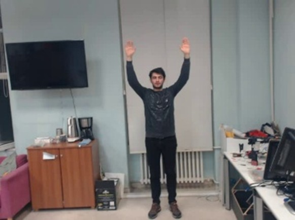

# Custom Hand & Body Gesture Dataset

This repository contains a dataset of 15 distinct hand and body gestures designed for Human-Computer Interaction (HCI) tasks, with a primary focus on intuitive drone control. The dataset includes raw video recordings and extracted image frames, along with a set of Python tools to help you contribute, expand, or replicate the data collection process.

    

- [About the Dataset](https://github.com/emrecandir9/custom-gesture-dataset?tab=readme-ov-file#about-the-dataset)
   - [Key Features](https://github.com/emrecandir9/custom-gesture-dataset?tab=readme-ov-file#key-features)
   - [Dataset Statistics](https://github.com/emrecandir9/custom-gesture-dataset?tab=readme-ov-file#dataset-statistics)
   - [Directory Structure](https://github.com/emrecandir9/custom-gesture-dataset?tab=readme-ov-file#directory-structure)
   - [Gesture Classes](https://github.com/emrecandir9/custom-gesture-dataset?tab=readme-ov-file#gesture-classes)
- [Getting Started](https://github.com/emrecandir9/custom-gesture-dataset?tab=readme-ov-file#getting-started)
  - [1. Clone the Repository](https://github.com/emrecandir9/custom-gesture-dataset?tab=readme-ov-file#1-clone-the-repository)
  - [2. Set Up a Virtual Environment](https://github.com/emrecandir9/custom-gesture-dataset?tab=readme-ov-file#2-set-up-a-virtual-environment)
  - [3. Install Dependencies](https://github.com/emrecandir9/custom-gesture-dataset?tab=readme-ov-file#3-install-dependencies)
- [How to Use the Tools](https://github.com/emrecandir9/custom-gesture-dataset?tab=readme-ov-file#how-to-use-the-tools)
   - [To Run:](https://github.com/emrecandir9/custom-gesture-dataset?tab=readme-ov-file#to-run)
   - [To Run:](https://github.com/emrecandir9/custom-gesture-dataset?tab=readme-ov-file#to-run-1)
 - [How to Contribute](https://github.com/emrecandir9/custom-gesture-dataset?tab=readme-ov-file#how-to-contribute)
 - [License](https://github.com/emrecandir9/custom-gesture-dataset?tab=readme-ov-file#license)
 


## About the Dataset

The goal of this project is to provide a clean, well-organized dataset for training and evaluating machine learning models on gesture recognition. The data was collected in indoor environments and features a single person performing each gesture.

### Key Features

* **15 Gesture Classes:** A comprehensive set of commands suitable for navigation and action controls.
* **Dual Format:** Includes both raw video files (`.avi`) and high-quality extracted frames (`.jpg`).
* **Structured & Labeled:** Data is organized into a clear directory structure based on gesture type and class, making it easy to parse and load.
* **Reproducible:** Comes with helper scripts to ensure that any new data you collect follows the exact same format and specifications.

### Dataset Statistics
The initial version of the dataset was collected from a few participants to ensure some diversity:

* Hand Gestures:

  * Participants: 2 different people.

  * Videos per Class: 2 videos for each gesture.

  * Images per Class: Approximately 270 frames.

* Body Gestures:

  * Participants: 3 different people.

  * Videos per Class: 3 videos for each gesture.

  * Images per Class: Approximately 325 frames.

### Directory Structure

The data is organized logically within the `dataset/` directory. The tools provided will automatically create and populate this structure.
```bash
custom-gesture-dataset/
└── dataset/
    ├── photos/
    │   ├── body/
    │   │   ├── closer/
    │   │   │   ├── uuid1.jpg
    │   │   │   └── uuid2.jpg
    │   │   └── down/
    │   │       └── ...
    │   └── hand/
    │       └── take_off/
    │           └── ...
    └── videos/
        ├── body/
        │   ├── palm/
        │   │   └── 20250622.214015.avi
        │   └── up/
        │       └── ...
        └── hand/
            └── left/
                └── ...
```

### Gesture Classes

The dataset is composed of the following 15 gestures. 

| Gesture Command | Hand Gesture | Body Gesture |
| :-------------- | :----------: | :----------: |
| `up`            |  |    |
| `down`          |      |        |
| `right`         |       |       |
| `left`          |       |      |
| `further`       |      |        |
| `closer`        |      |      |
| `land`          |      |       |
| `take_off`      |      |       |
| `photo`         |      |      |
| `video`         |      |      |
| `video_stop`    |      |       |
| `emergency`     |      |       |
| `follow`        |      |       |
| `palm`          |           |      —       |
| `no_class`      |      —      |      —      |

## Getting Started

Follow these steps to set up your environment and use the provided tools.

### 1. Clone the Repository

First, clone this repository to your local machine using Git.

```bash
git clone https://github.com/your-username/custom-gesture-dataset.git
cd custom-gesture-dataset
```
### 2. Set Up a Virtual Environment

It is a best practice to create a virtual environment to keep project dependencies isolated.

```Bash
# For Windows
python -m venv venv
venv\Scripts\activate
```

### 3. Install Dependencies
Install all the required Python packages using the `requirements.txt` file.

```Bash
pip install -r requirements.txt
```

## How to Use the Tools
The `tools/` directory contains two Python scripts to help you create and process data.

`01_record_videos.py`

Use this script to record new gesture videos using your webcam.


#### To Run:
```Bash 

python tools/01_record_videos.py
```

* The script will launch an interactive command-line prompt.

* First, select the gesture type (`hand` or `body`).

* Next, select the specific gesture you want to record.

* A webcam window will appear. Press the `R` key to start and stop recording.

* Press the `Q` key to quit and save the video file to the correct directory within `dataset/videos/`.


`02_extract_frames.py`

Use this script to process the videos you recorded and extract them into individual image frames.

#### To Run:

```Bash

python tools/02_extract_frames.py
```

* The script will automatically scan the `dataset/videos/` directory for any `.avi` files.

* A progress bar will show the extraction process.

* For each video, it creates a corresponding folder in `dataset/photos/` and saves the image frames there.


## How to Contribute
Contributions to this dataset are welcome! To add new data, please follow these guidelines to ensure consistency:

1. **Use the Provided Scripts:** Always use the `01_record_videos.py` script to ensure new videos have the correct format and naming.

2. **Clear Background:** Record against a neutral, non-cluttered background where possible.

3. **Good Lighting:** Ensure your hands and body are well-lit and clearly visible.

4. **One Gesture at a Time:** Perform the gesture clearly and return to a neutral position after each recording.

If you have suggestions for new gestures or improvements to the tools, please open an issue on GitHub to discuss it.

## License
This dataset and the accompanying code are released under the MIT License. You are free to use, modify, and distribute this project for any purpose, including commercial use, provided you include the original copyright and license notice.
